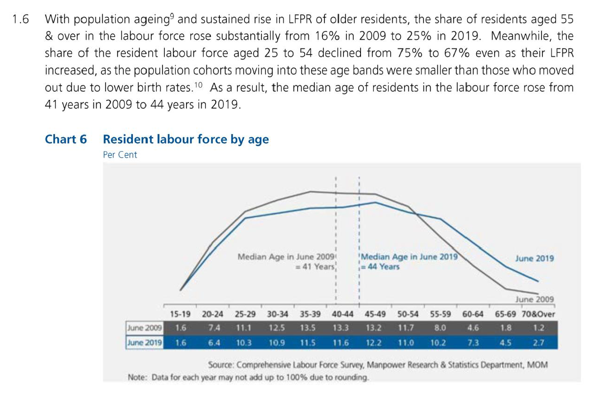
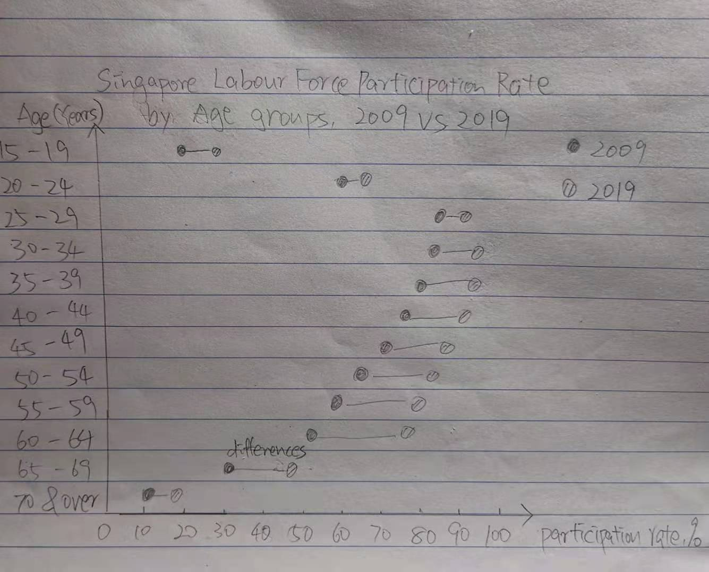
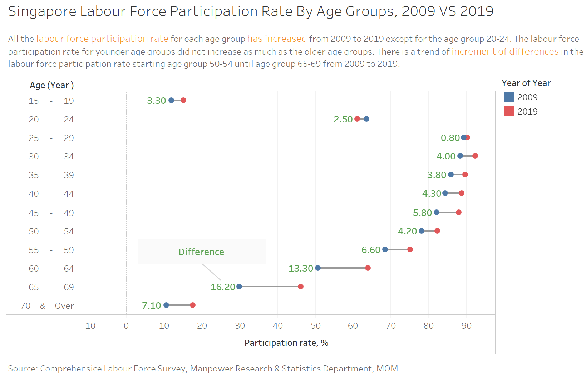
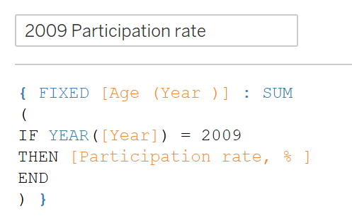
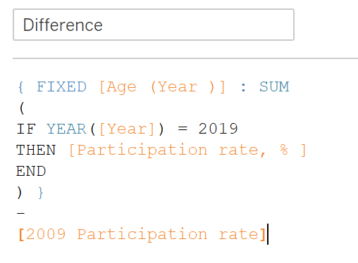

```{r setup, include=FALSE}
knitr::opts_chunk$set(echo = FALSE)
```

# 1. Critiques of the graph

Please see the graph and critiques from clarity and aesthetics aspects below.

**Clarity**

- The graph’s header is not clear and does not summarize and reveal the purpose and main idea of the graph. It could be clearer if it has a header that able to tell the audience the main purpose in a concise way and what the graph is revealing to the audience.
- There is no Y-axis label to show the value and reference point, e.g. starting point 0. And the unit "Per Cent" is below the header which is too far away from the graph. It should have clear axes that audience able to read from the graph.
- Using the line graph for age groups is a bad practice as age groups are not a continuous data type, and it can be misleading at points. It should use a bar chart or other suitable graph to present the categorical data.  
- The statement and the graph showing does not tally. That information stated in the statement cloud not be referred from the graph.

**Aesthetics**

- The color used to present 2009 and 2019 are not with strong contracts, especially using grey is too weak for the comparison. It is advisable to use more vibrate colors to presenting for the 2009 and 2019 data.
- The table below is with the background colour is redundant as the row name has already indicated the data with colour, it does not reveal or help with the visualization. It should highlight the difference where the audience should be paying more attention to.
- The source and note text are not aligned, one at center and another left-aligned. Both should be aligned for a neater presentation.  

#  2. Sketch of the proposed design

Concerning the critics above, I would like to suggest an alternative graphical presentation to improve the current design. Please see below for the sketch of the proposed design. 


The proposed design has four main improvements and advantages.

1.	It has a clearer header and telling the audience that the graph is a comparison between 2009 and 2019.

2.	There is clear Y-axis and X-axis to show the differences and age group.

3.	The dot graph is per category not continuous which is clearer and not misleading.

4.	The colors to be used to present 2009 and 2019 data will be with strong contrast in vibrate colors. 

# 3. Proposed data visualization designed in Tableau

Please see below for the proposed data visualization.


# 4. A step-by-step description of how the data visualization was prepared

The steps of creating the visualization shown above in the Tableau are as following: 
1.	Extract the defined age group data to an excel file named Labour Force participation rate, keeping the age group defined for 15-19, 20-24, 25-29, 30-34, 35-39, 40-44, 45-49, 50-54, 55-59, 60-64, 65-69, 70&over

2.	Load the data to Tableau and enable Data Interpreter to interpret the column name 

3.	Select column 2009 to 2019 and pivot table  

4.	Rename the pivot field names to Year and data type to Date. Rename pivot field values to participation rate 

5.	Drag [Age (Years)] to the Rows shelf

6.	Drag [Participation rate, %] to the Columns shelf

7.	Drag [Year] to Color on the marks card

8.	Drag [Year] to the Filter shelf

9.	In the Filter Field dialog, select Years and click Next >

10.	In the Filter dialog, check only 2009 and 2019 and click OK

11.	On the marks card, in the drop-down, select Circle

12.	Create a calculated field with the name "2009 Participation rate" with the calculation as the following:


13.	Create a calculated field with the name "Difference" with the calculation as the following:



14.	Drag [2009 Participation rate] to the Columns shelf

15.	Click [2009 Participation rate] on the Columns shelf to open the SUM (2019 Participation rate) marks card

16.	In the SUM (2009 Participation rate) marks card, do the following:

- In the dropdown, select Gantt Bar
- Remove YEAR(Year) from Color
- Drag [Difference] to Size and adjust the thickness
- Drag [Difference] to label and add annotate point on the empty space and type difference, point the arrow to the difference label

17.	Right-click [2009 Participation rate] on the Columns shelf and select Dual Axis

18.	Right-click the Sales axis at the bottom of the view and select Move marks to front

19.	Right-click [2009 Participation rate] on the Columns shelf and un-check Show Header

20.	Add it to the dashboard and add text boxes for header, description and source 

# 5. Three major observations revealed by the data visualisation prepared
1. All the labour force participation rate for each age group has increased from 2009 to 2019 except for the age group 20-24 with a decrease of 2.50%.  

2. The labour force participation rate for younger age groups did not increase as much as the older age groups. The age group below 44 increased less than 5.00% and age groups above have increased more than 5.00% for most of them. 

3. There is a trend of increment of differences in the labour force participation rate starting age group 50-54 until age group 65-69 from 2009 to 2019, and age group 65-69 with the most increase of 16.20%. 

Thank you for reading my blog. 


