```{r setup, include=FALSE}
knitr::opts_chunk$set(echo = FALSE)
```
# 1. Critiques of the graph

Please see the graph and critiques from clarity and aesthetics aspects below.

**Clarity**

- There is no overall title for the two data visualizations, it is unclear to audience what's the key message the author would like to convey.  
- The graph’s legend is not clear, it states "Vac1", but what exactly "Vac 1" presents is not clear to audience. Only for 1 and 5 it stated the context "Strongly agree" and "Strongly disagree", the number 2, 3, 4 are not clear to audience what they're representing.  
- The left graph and the right graph is not synced in terms of the sorting of the Y-axis where the left graph sort by alphabetical order and the right graph sort by the percentage of the people who strongly agreed. 
- There is no additional information provided in the second graph for the purpose of showing the strongly agree with sorting as it can be easily achieved in one graph by having the strongly agree at the starting and then sort it.

**Aesthetics**

- The color used to present the strongly agree to strongly disagree does not show a good contrast and meaning, for example using green to presenting strongly disagree does not match with audiences' usual cognition. 
- Both graphs X-axis's are not standardized, graph 1 with no decimal place where graph 2 has 1 decimal place.
- There is a typo in the graph 1 title where vaccine is spelled as "vacinne". 
- The countries label is not with first letter capitalized, which is not professional.

#  2. Sketch of the proposed design

Concerning the critics above, I would like to suggest an alternative graphical presentation to improve the current design. Please see below for the sketch of the proposed design. 

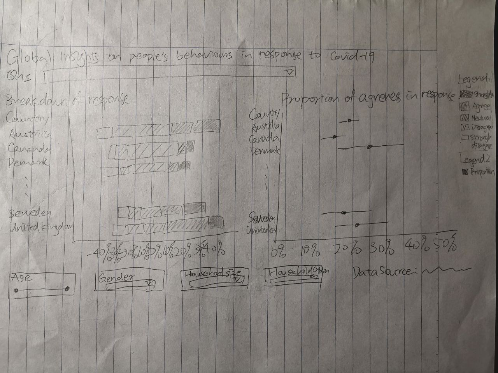
The proposed design has four main improvements and advantages.

1. It has a clearer header to tell the audience what's the key message is trying to deliver.

2. The sorting for both graphs' Y-axis is the same and audience can easily to cross reference for the 2 graphs. 

3. The color of the graph will be in more contrast and reveal information about the responses. 

4. The country names are capitalized. 

5. The legend has made clearer and the audience knows what's the question about and what does each color indicates. 

6. The second graph is now more meaningful which shows the proportion of each country's agreeness to the questions which includes "Strongly agree" and "Agree".

7. Both graphs have the same decimal places for X-axis and make the entire dashboard standardized.

# 3. Proposed data visualization designed in Tableau

Please see [here](https://public.tableau.com/profile/liu.jie5917#!/vizhome/GlobalinsightsonpeoplesbehavioursinresponsetoCOVID-19/Dashboard1?publish=yes) for the proposed responsive data visualization.

# 4. A step-by-step description of how the data visualization was prepared

**Data preparation**

1. Extract the columns which we are interested in, select the column "vac_1", "vac2_1", vac2_2", "vac2_3", "vac2_6", "gender", "age", "household_size", "household_children" for the 14 countries.

<div style="width:500px; height:350px">

<div>

2. Use union in tableau and import all data sets. 

<div style="width:500px; height:350px">

<div>

3. Rename the column names and data type to the following

<div style="width:500px; height:100px">

<div>

4. Rename the file to Country and update the aliases. 


**Breakdown of responses**

1. Create parameter Survey questions as the following
<div style="width:500px; height:350px">
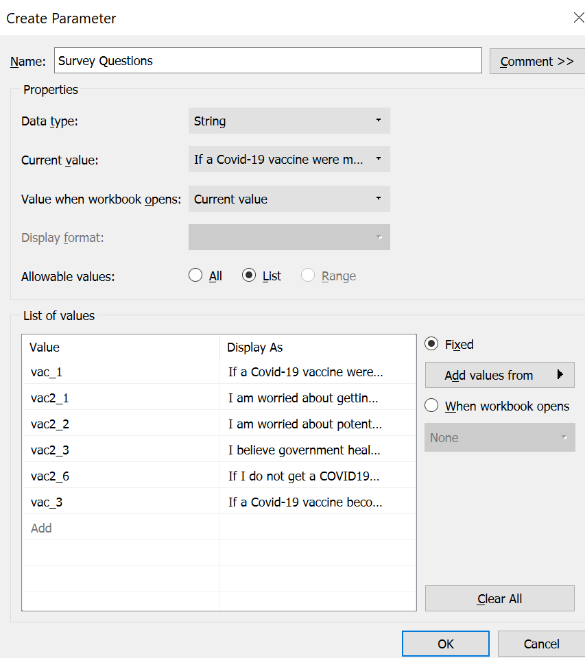
<div>

2. Create calculation field Question Selector as the following 


3. Edit the Question Selector aliases as the following 
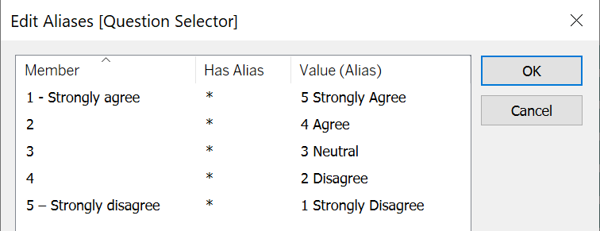

4. Create calculation field Number of records as the following 

5. Create calculation field Total count as the following 
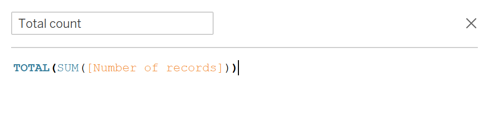
6. Create calculation field Percentage as the following 
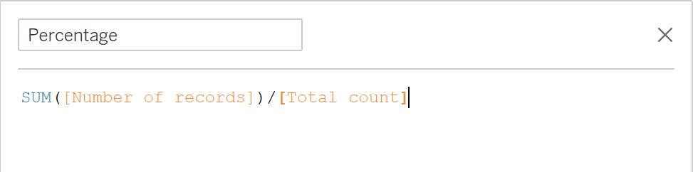
7. Create calculation field Score as the following 

8. Create calculation field Count negative as the following 

9. Create calculation field Total count negative as the following 
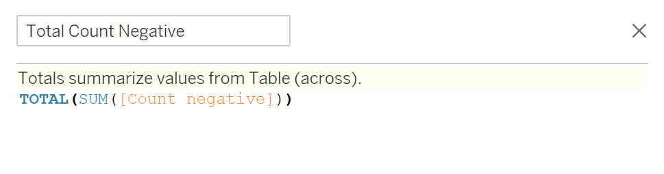
10. Create calculation field Gantt start as the following 
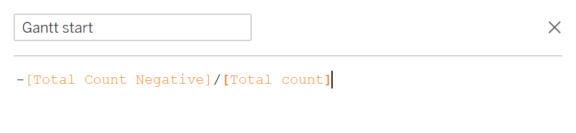
11. Create calculation field Gantt percent as the following 
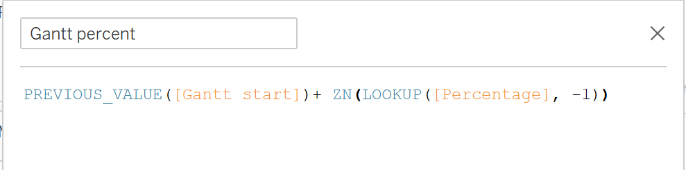
12. Drag gantt percent to column and country to row

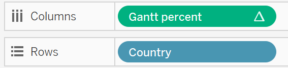

13. Right click on gantt percent and change the compute using to Question Selector 
<div style="width:500px; height:350px">

<div>

14. Drag the following to marks to the corresponding mark, and change it to gantt bar
<div style="width:200px; height:350px">
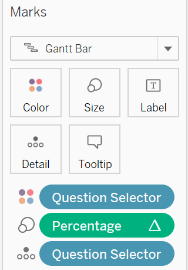
<div>

15. Drop the following to filters and click show filter
<div style="width:200px; height:350px">

<div>

16. Right click Survey questions and select show parameters.

17. Change the filter option to range for age and single value (dropdown) for others.


18. Change the title and the graph 1 is completed
<div style="width:500px; height:350px">

<div>


**Proportion of agreeness**

1. Create calculation field Proportion as the following which is the proportion of both "Strongly Agree" and "Agree"

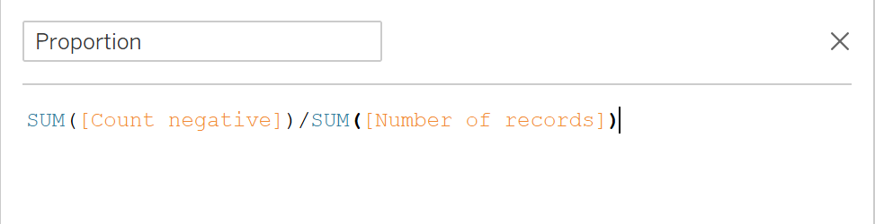

2. Create calculation field Prop_SE as the following

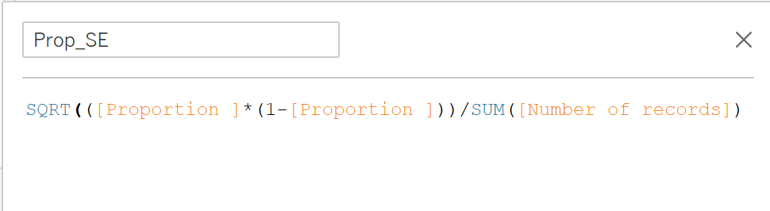

3. Create calculation field Z_95% as the following


4. Create calculation field Prop_Margin of Error 95% as the following 
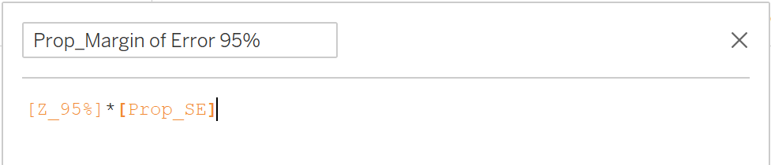
5. Create calculation field Prop_Lower Limit 95% as the following 

6. Create calculation field Prop_Upper Limit 95% as the following 


7. Drag Proportion and measure values to column and country to row, right click on any of the columns and select dual axis 

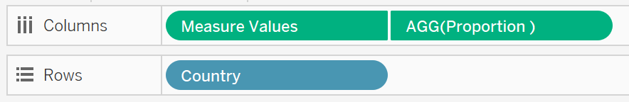

8. Remove other measure values and only remain upper and lower limit 

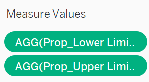


9. Change marks of measure values to path 
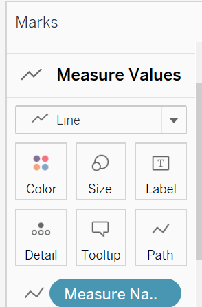

10. Change the AGG(Proportion) measure name to color and adjust the size and color 


11. Change all filters to be applied to all using this data source 


12. Change the title and graph 2 is completed 


**Dashboard**
1. Go to the dashboard and drag both sheets to the dashboard

2. Rearrange the filters positions

3. Add text as title to the dashboard

4. Add text as data source to the dashboard 

5. The dashboard could be show as the following 


# 5. Three major observations revealed by the data visualisation prepared
1. In general, female is more acceptable and faithful to the vaccine compare to man, from the filtered graph of the proportion of agreeness in response to the question of "If a Covid-19 vaccine were made available to me this week, I would definitely get it" and "I believe government health authorities in my country will provide me with an effective COVID19 vaccine"

**"If a Covid-19 vaccine were made available to me this week, I would definitely get it"**


**"I believe government health authorities in my country will provide me with an effective COVID19 vaccine"**


2. People of age 70 and above are more willing to get vaccinated and less concerned about the side effects across all country compare to the younger age group, however at the same time the uncertainty at 95% is higher too. For example below is showing the response to "If a Covid-19 vaccine were made available to me this week, I would definitely get it". 

3. People in Japan are generally having a stronger negative emotion to COVID compared to others where they are more worried about getting COVID and worried about the side effect of the vaccine.


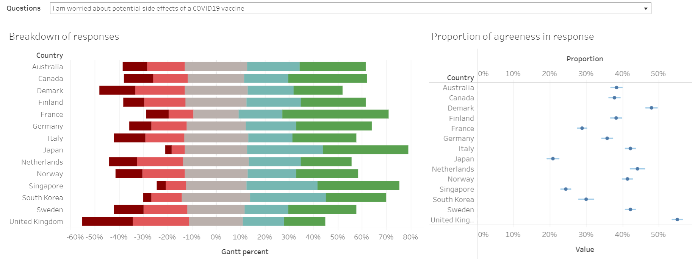

Thank you very much for reading my blog. 

Distill is a publication format for scientific and technical writing, native to the web.

Learn more about using Distill at <https://rstudio.github.io/distill>.


