```{r setup, include=FALSE}
knitr::opts_chunk$set(echo = FALSE)
```

# 1. Critiques of the graph

Please see the graph and critiques from clarity, aesthetics and interactivity aspects below. The link of the original dashboard can be found here https://public.tableau.com/profile/tskam#!/vizhome/South-eastAsiaArmedConflictAnalysis/South-eastAsiaArmedConflictAnalysis
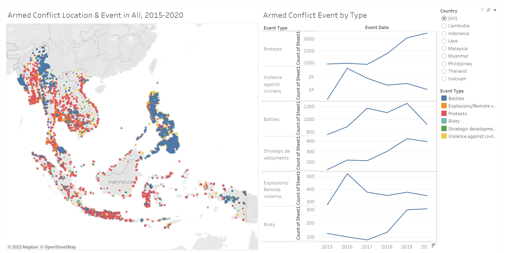
**Clarity**

- For the graph on the left, the conflicts are presented by the dot in the same size, it's hard for audience to know the frequency as some of them are cluttered together. 
- For the graph on the right, the Y-axis are inconstant for the different event types, which causes confusion to readers on the number of events happened in that year.  
- The data source is not indicated on the dashboard. 

**Aesthetics**

- For the graph on the right, the color used for the line presenting the event type does not sync with the legend. 
- For the graph on the right, the label "Count of Sheet1" does not provide additional information and made the overall graph less clean. 

**Interactivity**

- There is only two filters available for selection, adding "Year" would be more useful to do deeper analysis by years.

- The tooltip of both graphs does not provide additional information to audience. 


#  2. Sketch of the proposed design

Concerning the critics above, I would like to suggest an alternative graphical presentation to improve the current design. Please see below for the sketch of the proposed design. 

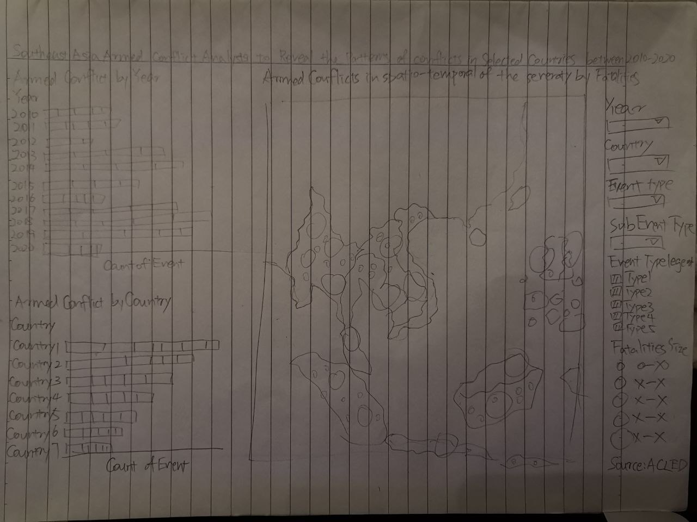
The proposed design has four main improvements and advantages.

1.	Add a key indicator "fatalities" and represent in size to reveal the severity of the conflicts.

2.	Add the data source of the graph.

3.	All the color legends are synced.

4.	Graphs are as clean as possible, there is no redundant information. 

5.  There are more filters available for the audience to do deeper analysis.

6.  The tooltip will able to provide additional information to audience. 

# 3. Proposed data visualization designed in Tableau

Please see the link below for the proposed data visualization.

https://public.tableau.com/profile/liu.jie5917#!/vizhome/makeover3_16163319443800/Dashboard1?publish=yes

# 4. A step-by-step description of how the data visualization was prepared

The steps of creating the visualization shown above in the Tableau are as following: 

**Steps for the Map**

1.	Drag the Longitude and Latitude to Columns and Rows respectively.

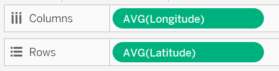


2.	Drag Event Type to Color, Fatalities to Size, Event Id Cnty to Detail.

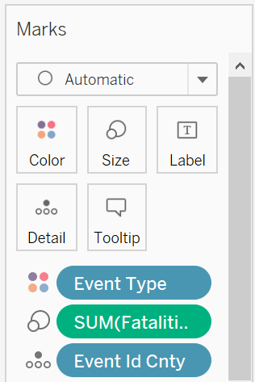


3.	Edit the Size.

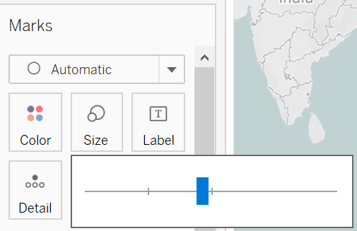


4.	Drag the following to Tooltip.

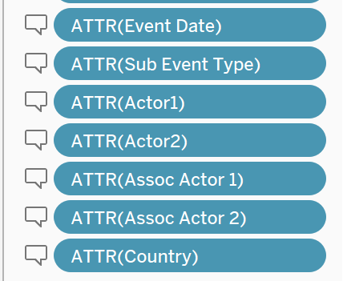


5.	Click on Tooltip in Mark and arrange them as the following.

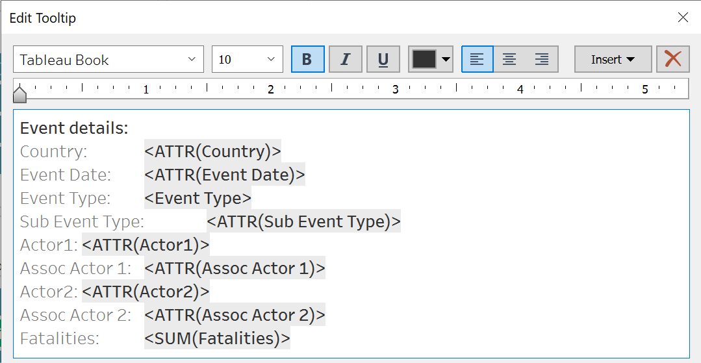

6.	Drag YEAR, Event Type, Sub Event Type and Country to filter and right click to enable Show Filter.

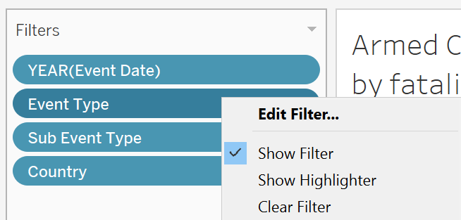


7.	Double click on the header and give it an meaningful name such as below. 

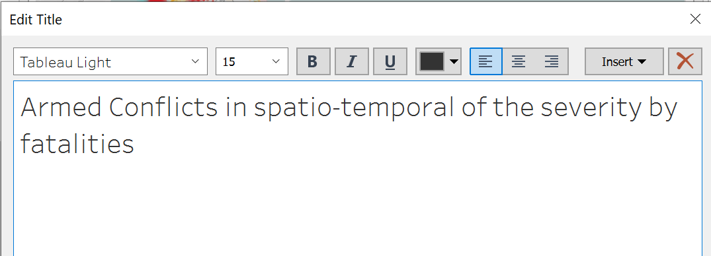

**Steps for the Conflict by Year**

8.	Drag Sheet1 and Year to Columns and Rows respectively.

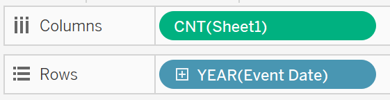


9.	Drag Event Type to Color.

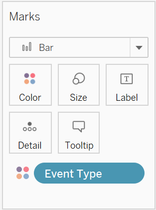

10.	Select Stacked Bar Chart at Show Me.

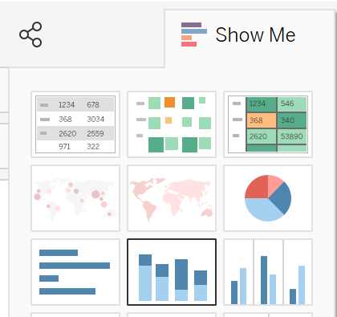


11.	Create a new Sheet for the Tooltip.

12. Drag Country and Sheet1 to row and columns respectively and select Pie Chart at Show Me. 

13. Pie Chart will be displayed, right click Angle CNT(Sheet1), quick table calculation to Percent of Total.

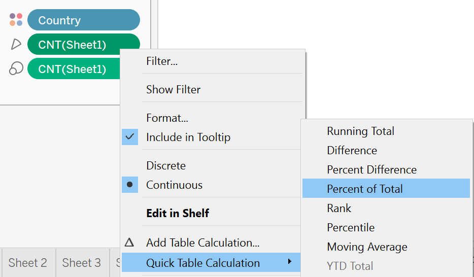


14.	Drag Country and the computed CNT(Sheet1) to label. 

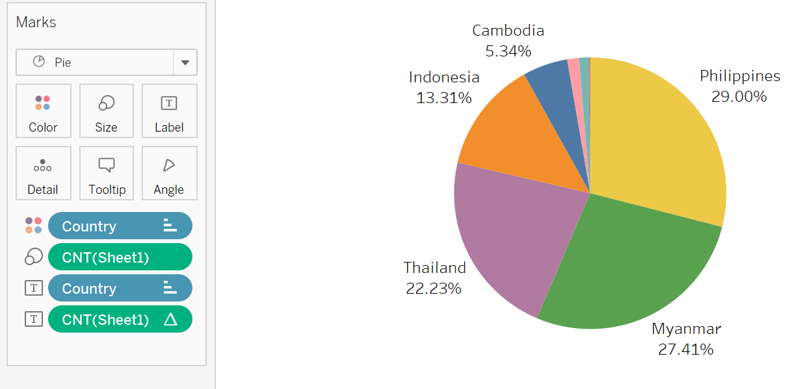

15. Insert a reference line, average by right click the X-axis

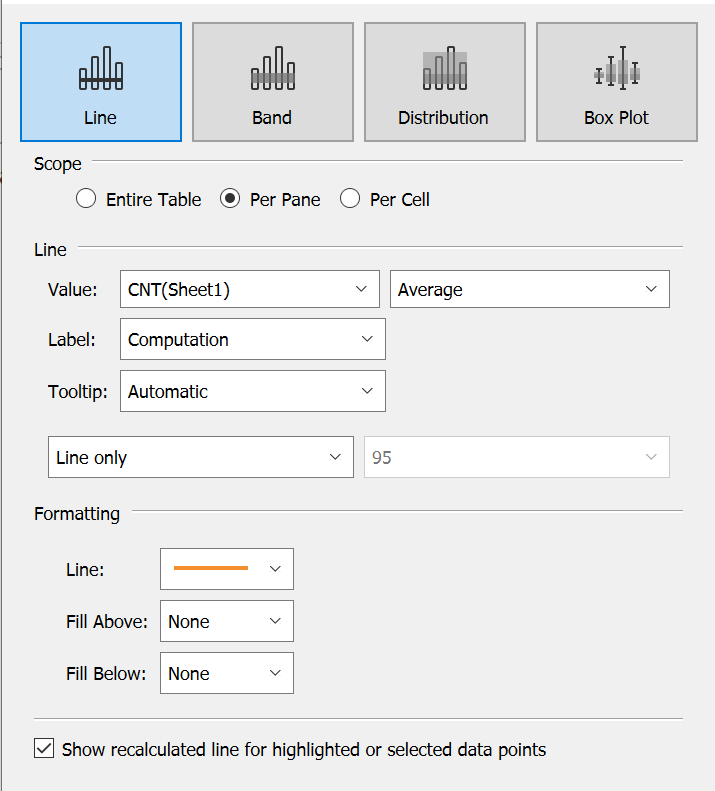


16.	Back to the Conflict by Year graph and click on the Tooltip and insert the Pie chart generated.

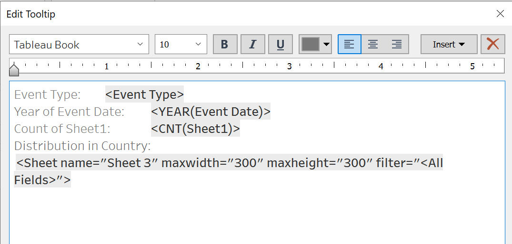

17.	Rename the Sheet1 to Number of Events at the X-axis. Double click on the header and give it an meaningful name such as below. 

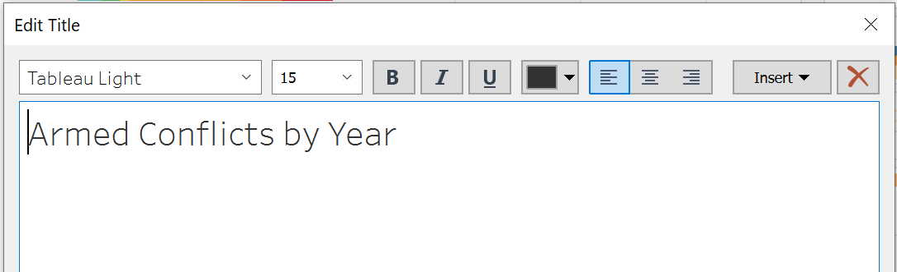

**Steps for the Conflict by Country**


18.	Drag Sheet1 and Country to Columns and Rows respectively.

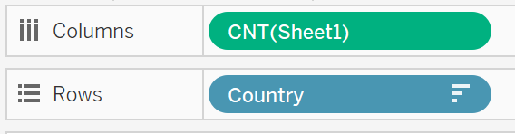


19.	Drag Event Type to Color.


20.	Select Stacked Bar Chart at Show Me.


21.	Create a new Sheet for the Tooltip.

22. Drag Year and Sheet1 to row and columns respectively and select Line Char at Show Me. 

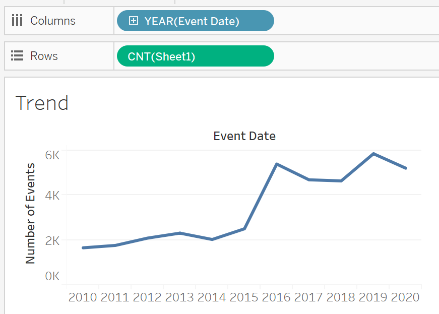


23.	Back to the Conflict by Country graph and click on the Tooltip and insert the Line Graph generated.

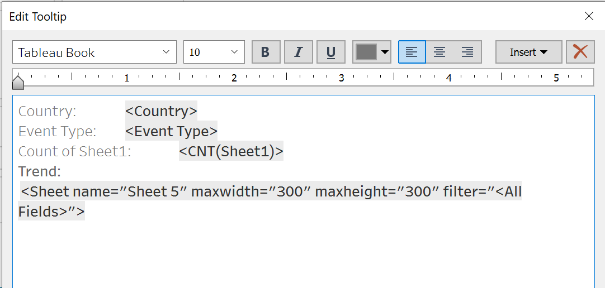

24.	Rename Sheet1 to Number of Events at the X-axis. Double click on the header and give it an meaningful name such as below. 

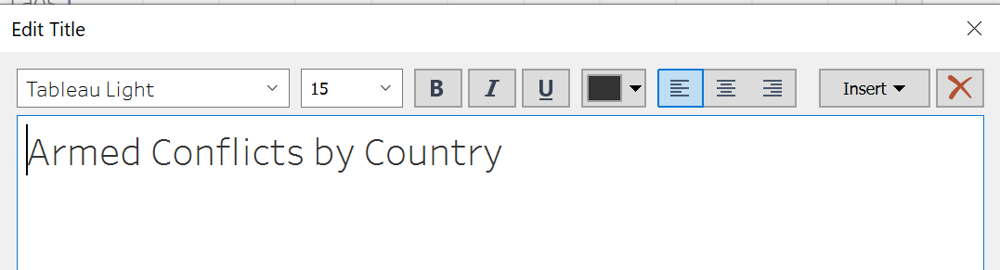


**Steps for the final Dashboard**

25.	Open a new dashboard, drag the above three graph in. 

26. Add text box for the title and source, the final dashboard looks like below.

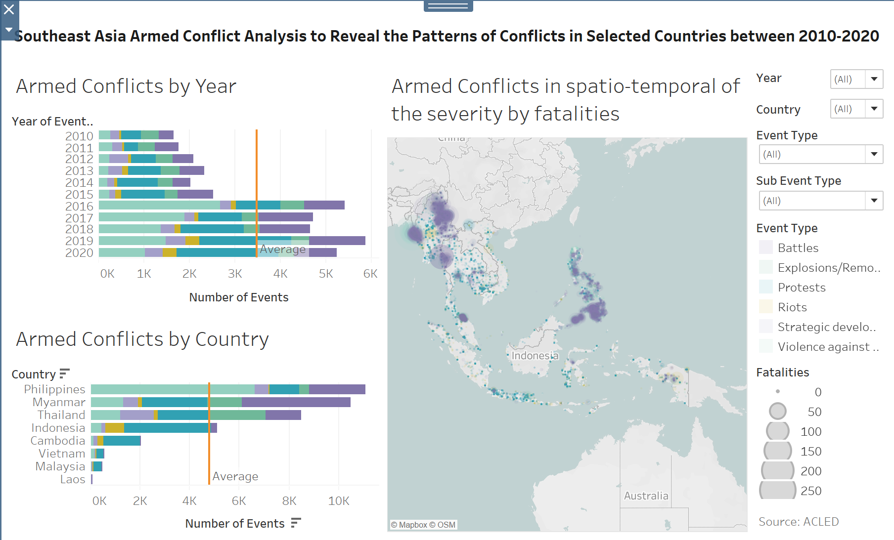


# 5. Five major observations revealed by the data visualisation prepared
1. Over the years, the number of armed conflicts keeps increasing in the Southeast Asia. The number of events almost doubled after year 2015 and keep as high. It's higher than the average after year 2015. 

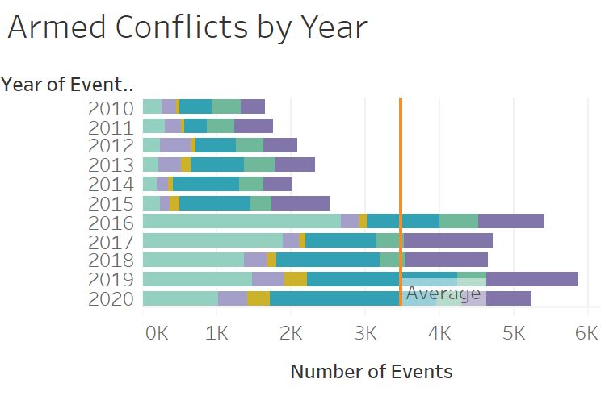

2. Philippines has the most number of conflicts and then followed by Myanmar. Thailand and Indonesia also has more than the average. 

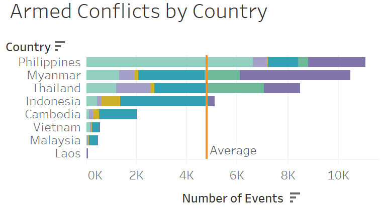


3. The number of fatalities at Philippines and Myanmar are as high as well. 

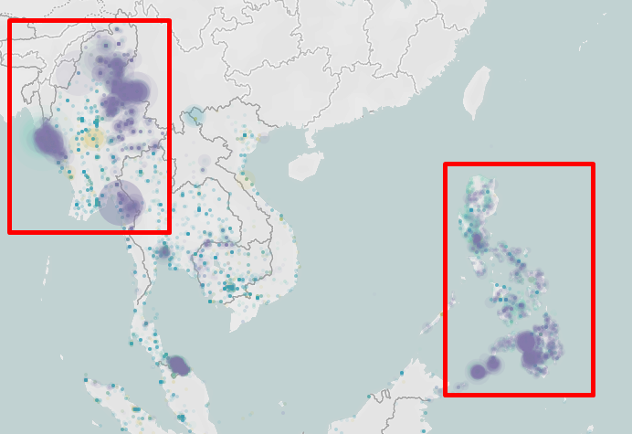

4. The event type Explosions/Remote violence has about the same number of events across the years.

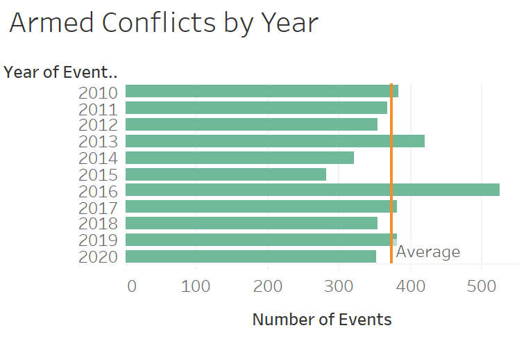

5. Have a closer look at the Country - Philippines which has the most number of events, most of the event type is Violence against civilians. 

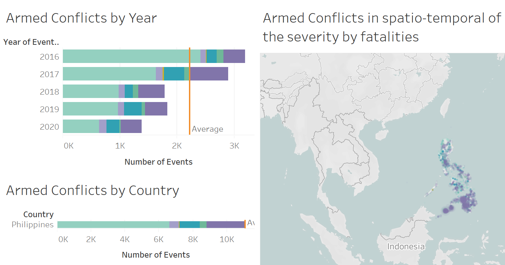

Thank you very much for reading my blog. 


